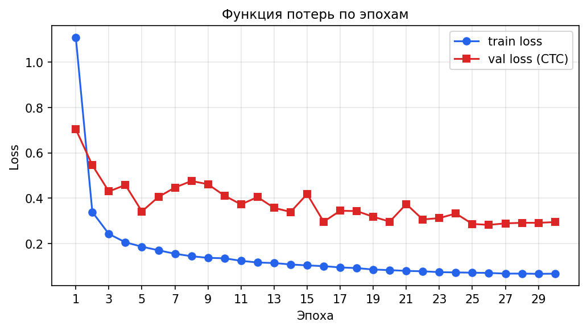
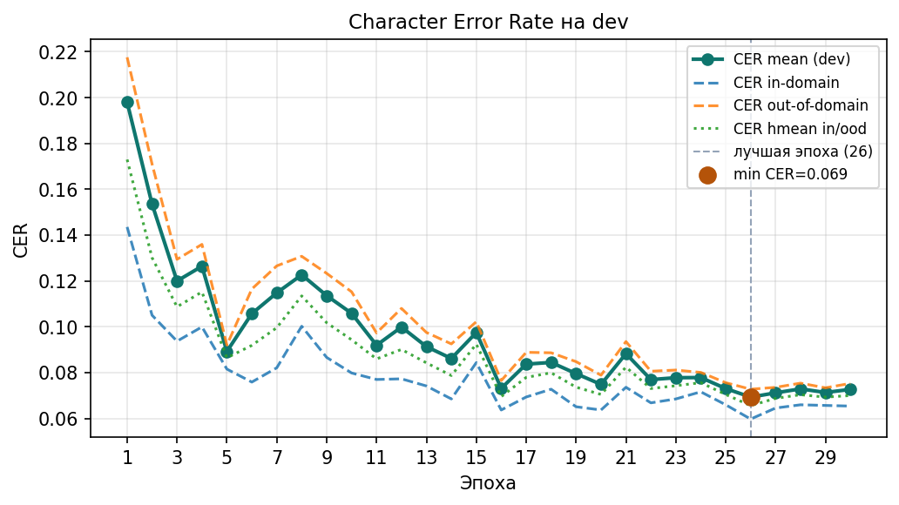
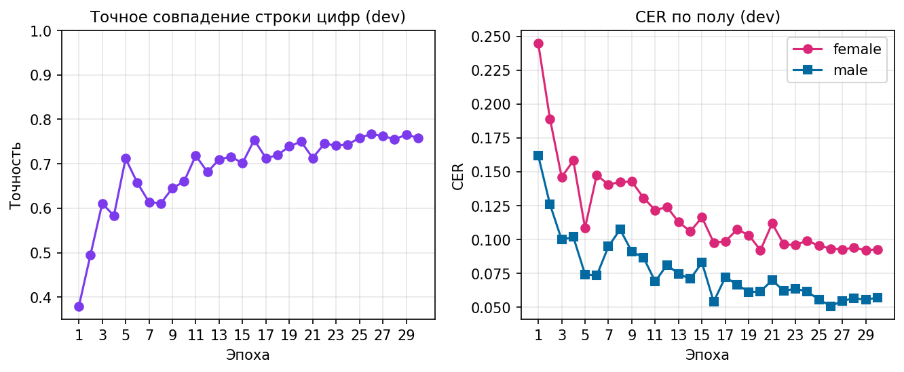
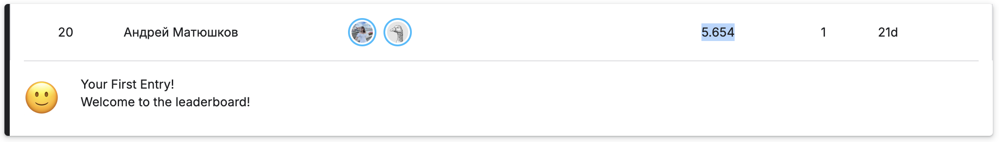

# Отчёт о работе над распознаванием произнесённых чисел (русский ASR)

**Авторы:** Горохова Александра (2 курс), Матюшков Андрей (1 курс), ИТМО.

---

## 1. Задача и контекст

Нужно по аудиозаписи устной речи на русском языке предсказать целое число, которое было произнесено. В нашем пайплайне это сведено к распознаванию строки из цифр (символьный выход с CTC), после чего строка приводится к целому для сабмита (в т.ч. обработка пустого распознавания и выхода за допустимый диапазон — см. `src/text_normalize.py`).

---

## 2. Модель и обучение

### Архитектура

Используется **end-to-end** модель `DigitCTCModel` (`src/model.py`):

- вход: моно **16 kHz**;
- **MelSpectrogram** (80 мел-каналов) + **AmplitudeToDB**;
- на обучении — **SpecAugment** по лог-мел (`LogMelSpecAugment`; на инференсе отключается в `eval`, так как завязан на `training`);
- **четыре слоя Conv1d** с увеличением числа каналов и даунсэмплингом по времени;
- **двунаправленный блок GRU** и линейный слой на **11 классов** (цифры 0–9 + CTC blank).

### Цель обучения и метрики

Целевая разметка для CTC в основном прогоне — режим `digits` (строка цифр). В коде также предусмотрен режим `words` (русские слова через `num2words`), но в зафиксированном прогоне бейзлайна ниже использовались цифры.

На **dev** логируются:

- **CER** по символам усреднённо по всем высказываниям;
- **точное совпадение** всей строки цифр (`seq_accuracy`);
- разрез **in-domain / out-of-domain** по спикерам (есть ли спикер в train), плюс **гармоническое среднее** CER по этим двум группам (`cer/hmean_in_ood`);
- разрезы по **спикерам** и **полу** (для анализа слабых групп).

### Гиперпараметры зафиксированного эксперимента

По файлу `runs/ctc_baseline/hparams.txt` (и логике `train.py`):

| Параметр | Значение |
|----------|-----------|
| Эпохи | 30 |
| Batch size | 16 |
| Оптимизатор | AdamW, `lr=1e-3`, `weight_decay=0.01` |
| Планировщик | CosineAnnealingLR |
| Клиппинг градиента | 5.0 |
| Аугментации | волна (gain/noise) + SpecAugment |
| `text_mode` | `digits` |
| Число параметров (лог TensorBoard) | **≈ 1.1×10⁶** |

Обучение велось на GPU

---

## 3. Результаты на dev

История по эпохам записана в `runs/ctc_baseline/metrics.jsonl`. Графики ниже построены по этому файлу скриптом `scripts/plot_report_figures.py` (PNG лежат в `report/figures/`).

### Графики

*Рис. 1.* Сходимость CTC-потерь на обучении и на dev: быстрое падение в первые эпохи, затем плато с флуктуациями.

*Рис. 2.* Средний CER по всем высказываниям dev и разрез по спикерам (in-domain / out-of-domain), плюс гармоническое среднее. Вертикальная линия и маркер — эпоха с минимальным `val_cer/mean` (**26**).

*Рис. 3.* Слева — доля полностью верно распознанных чисел на dev. Справа — CER отдельно для записей с меткой female / male в манифесте.

Краткий анализ:

- **Первая эпоха:** `val_cer/mean` ≈ **0.20**, точное совпадение последовательности ≈ **38%**.
- К середине обучения метрики заметно улучшаются; встречаются колебания.
- Лучшая по среднему CER на dev эпоха — 26. Дальше на 27–30 эпохах средний CER слегка ухудшается, что похоже на начало переобучения или шум валидации.

| Метрика (эпоха 26) | Значение |
|--------------------|----------|
| `val_cer/mean` | **≈ 0.069** (~6.9% ошибок на символ в среднем по высказываниям) |
| `val_seq_accuracy` | **≈ 0.767** (~76.7% полностью верных чисел) |
| `val_cer/in_domain` | ≈ 0.060 |
| `val_cer/out_of_domain` | ≈ 0.073 |
| `val_cer/hmean_in_ood` | ≈ 0.066 |
| `val_loss` (CTC) | ≈ 0.28 |

По разрезам **пол** в ту же эпоху: CER для female выше, чем для male, что совпадает с интуицией о разном объёме данных или сложности записей. По **спикерам** наиболее «тяжёлыми» остаются отдельные id (например, в разных эпохах заметен более высокий CER у `spk_K` и др.) — это наводит на мысль о дообучении с балансировкой или спикер-нормализации в будущем.

Чекпоинт с **лучшим** `val_cer/mean` по критерию обучения сохраняется в `checkpoints/ctc_baseline/best.pt` (см. `train.py`).

---

## 4. Что можно улучшить дальше

- Попробовать **режим `words`** для CTC или гибрид постобработки.
- **Beam search** вместо жадного декодирования CTC.

---

## 5. История сабмитов на Kaggle

Название команды на kaggle: Андрей Матюшков (пока не изменено)

История сабмитов:
- baseline submission - 5.654 (by Aleksandra)

